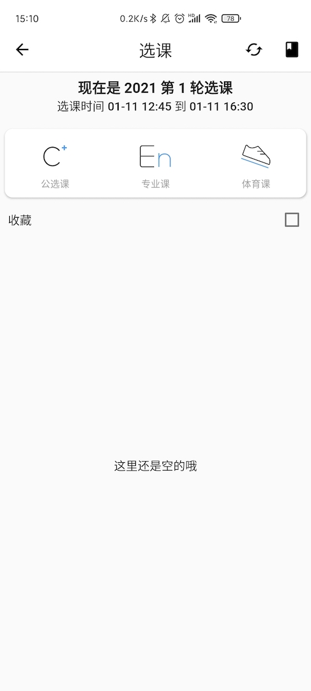
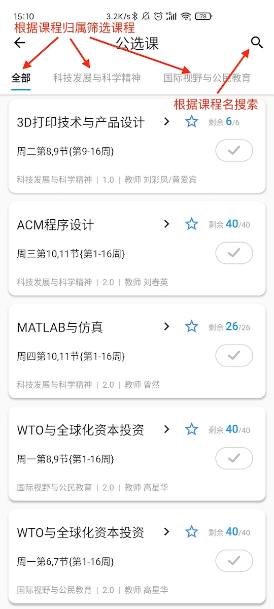
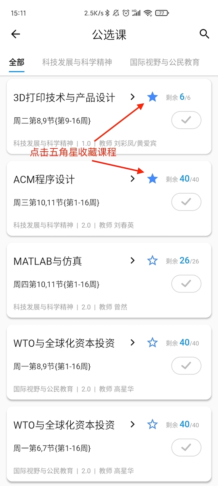
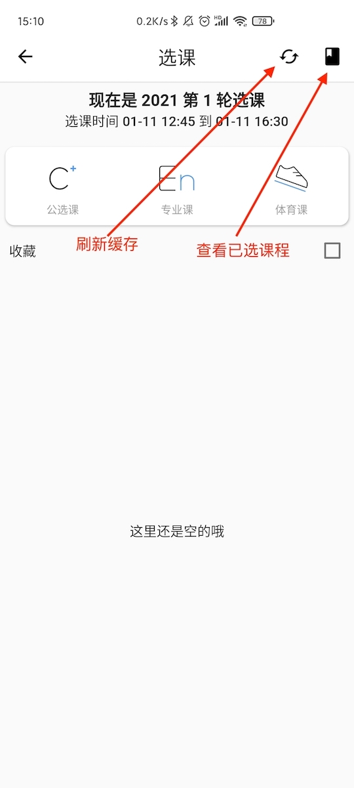
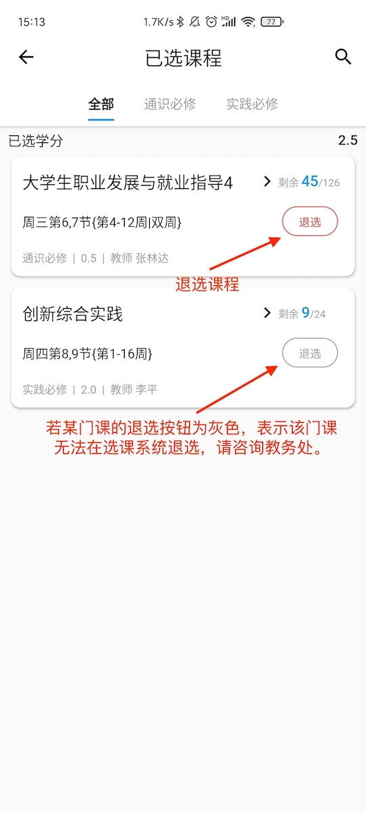

HduIn 对接学校的选课系统，为你提供更快捷方便的选课体验。

## 选课经验

0. 先抢网课(不在 HduIn 内)
1. 优先选体育课
2. 后面就随便了

## 支持类型

- [x] 选选修课
- [x] 选专业课
- [x] 选体育课

## 选课教程

1. 进入 HduIn 选课界面，我们能看到当前选课轮次、选课时间等信息。

2. 我们以选公选课为例，进入「公选课」选项卡，就能看到当前可供选择的公选课列表及其简要信息，如课程名称、上课时间、当前余量等。导航栏右侧的放大镜为搜索功能，可根据课程名来搜索课程。

3. 选课的操作相对于学校正方系统进行了简化，我们只需要先用蓝色对勾选中需要的课程，然后点击屏幕下方的选课按钮，最后在弹出的对话框中点击确认即可，不需要像网页端正方系统一样输入验证码。

4. 点击单个课程的卡片可查看单个课程的详细信息，在查看的同时也能进行单个课程的选课操作。

5. 我们还为大家提供了收藏+一键选课的功能。点击课程列表中，课程名称边上的五角星来收藏课程。收藏成功后，在选课主界面就能看到我们已经收藏的全部课程，此时我们只需要点击收藏右边的框全选后，点击下方的选课按钮即可一键全选收藏列表的课程。

6. 在选课主页面的右上角有两个按钮，一个是刷新课程列表缓存，若选课数据异常时可尝试点击修复；另一个是查看已选课程，在这里能方便的查看自己已选的学分、退选自己已选的课程。

## 注意事项

1. 创新实践课不可退选。
2. 下拉刷新刷的是课程余量，不会更新选课列表。
3. 如果无法加载选课列表，请尝试清除缓存。
4. 课程搜索仅能搜索本地已加载的课程列表。

## 已知问题

- 在已选课程里面进行收藏操作，之后在选课页面中可以进行选课操作，这时如果尝试去选已选课程，会出现`此课程不可操作的错误`。
